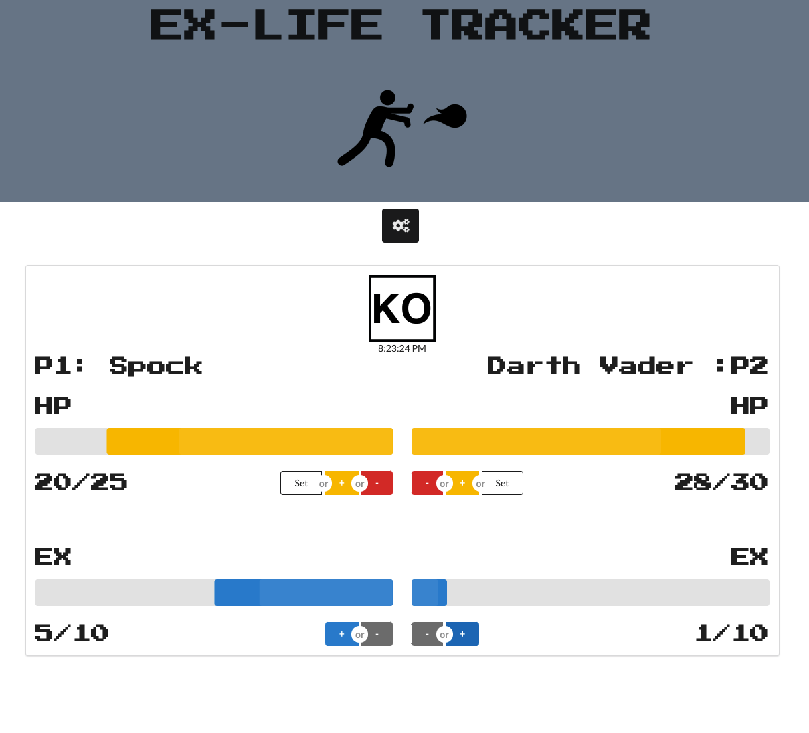

# Ex-Life Tracker App

## Technologies:
- React.js
- JavaScript (EchmaScript 2018)
- HTML5
- CSS3
- Semantic UI React
- Howler

## References:
### Information:
// https://scotch.io/@micwanyoike/how-to-add-fonts-to-a-react-project
// https://react.semantic-ui.com/modules/progress/#content-progress
// https://www.w3schools.com/howto/howto_css_flip_image.asp
// https://www.youtube.com/watch?v=_SPl7QHb6wU
// https://stackoverflow.com/questions/44715819/iframes-and-react-js-how-to-embed-a-youtube-video-into-my-app
// https://www.npmjs.com/package/react-howler/v/0.1.3
### Art:
// https://fonts.google.com/specimen/Press+Start+2P?preview.text_type=custom
// https://thenounproject.com/search/?q=ko&i=1054604
// https://thenounproject.com/term/fireball/1112042/
### Sounds:
// https://freesound.org/search/?q=KO+fight&f=type%3A%22wav%22&s=score+desc&advanced=0&g=1
// https://freesound.org/people/Taira%20Komori/sounds/214211/
// https://freesound.org/people/ProjectsU012/sounds/341695/
// https://freesound.org/people/Syna-Max/sounds/64939/
// https://freesound.org/people/Julien%20Matthey/sounds/105016/
// https://freesound.org/people/marcuslee/sounds/42106/
// https://freesound.org/people/SeanSecret/sounds/440663/